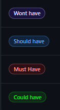

# **Agile Process**

[Go back to the README](README.md)

To check the project's board click [here](https://github.com/users/EdsonSMartins/projects/4).

## **Methodology**

I decided to group my features into Epics and create several User Stories for each epic. To prioritize the stories, I used MoSCoW Prioritization. To represent this in my Kanban board I created custom labels (must have, should have, could have and won´t have).

During the website development, I adhered to the principles of Agile methodology by incorporating the following key aspects:

### GitHub Projects/Kanban Board
GitHub Project Boards and Kanban are instrumental in collaborative project management. Refers to a feature within GitHub that allows users to organize and track their work using a visual project management tool. It’s similar to a kanban board and can be used to manage tasks, plan sprints, and keep track of progress on issues, pull requests, and notes. Users can create boards, customize columns, and assign tasks to team members, making it a powerful tool for Agile development and project management. 

Kanban

### Moscow Prioritization

Moscow Prioritization is a popular method used in project management, particularly within Agile frameworks, to prioritize tasks or requirements. The acronym "MoSCoW" stands for four categories:

- Must Have: Critical requirements that are non-negotiable. The project will fail without these
- Should Have: Important requirements that are not essential but add significant value. They should be included if possible.
- Could Have: Desirable requirements that are not necessary but would be nice to have. These can be included if time and resources allow.
- Won't Have: Requirements that are agreed upon as the least critical or out of scope for the current iteration. These are deferred or excluded.

labels

Unfinished user stories can be found in either to-do or the won't have section of my project board.

### Epics

In Agile project management, Epics are large bodies of work that can be broken down into smaller tasks called user stories. They represent a significant piece of functionality or a high-level feature that will take more than one sprint to complete.

Epics

### User Stories

Within each epic, there are several user stories. Each user story is accompanied by a description, acceptance criteria, and some of them also has a set of tasks that need to be completed before it can be marked as done.

User Stories

