# The Cheesecake Company 
Cheesecake Company is a website built in Django using Python, JavaScript, CSS and HTML. Built with a user-centered approach. It main purpose is to enable users to create, control and cancel bookings and orders while the admin can change, update and delete the same information from the backend.

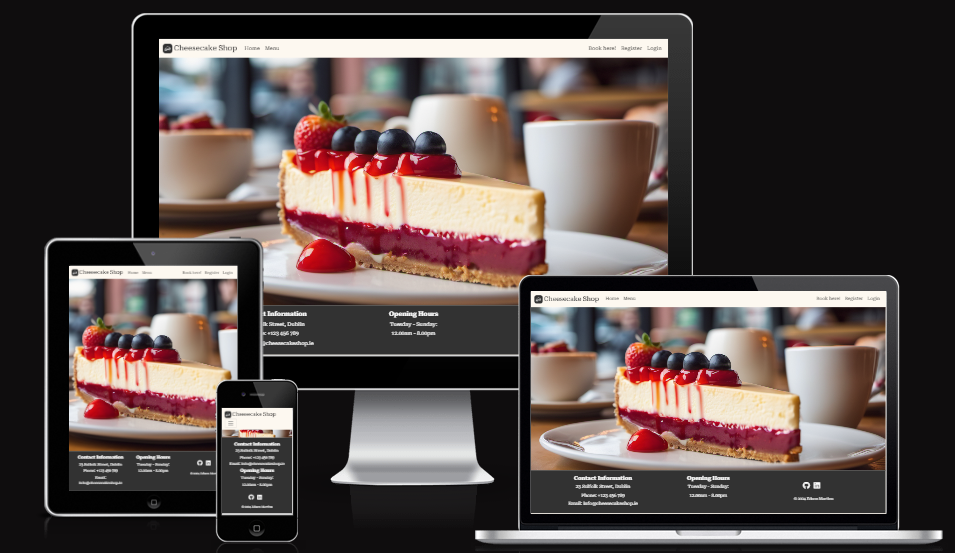\
 

The live deployed application can be found deployed on [Heroku](https://pp4-cheesecake-c25e3fb56709.herokuapp.com/).

The link to my Github repository's [Github Repo](https://github.com/EdsonSMartins/PP4-cheesecake_shop_V2).

# **Table of Contents**

<!-- TOC -->
* [**The Cheesecake Company**](#the-cheesecake-company)
* [**Table of Contents**](#table-of-contents)
* [**Planning**](#planning)
  * [**Strategy Plane**](#strategy-plane)
    * [**Target Audience**](#target-audience)
    * [**Site Goals**](#site-goals)
  * [**Scope Plane**](#scope-plane)
    * [**Scope Plane**](#scope-plane)
    * [**Necessary Features:**](#necessary-features)
    * [**Nice-to-have Features:**](#nice-to-have-features)
  * [**Structure Plane**](#structure-plane) 
    * [**Epic: User Authentication**](#epic-user-authentication)
    * [**Epic: Bookings**](#epic-bookings)
    * [**Epic: Collection orders**](#epic-collections-order)
    * [**Epic: Content Moderation and Review**](#epic-content-moderation-and-review)    
  * [**Skeleton Plane**](#skeleton-plane)
    * [**Wireframes**](#wireframes)
    * [**Database Schema**](#database-schema)
  * [**Surface Plane**](#surface-plane)
    * [**Design**](#design)
    * [**Colors and Fonts**](#colors-and-fonts)
    * [**Logo**](#logo)
  * [**Features**](#features)
  * [**Future Enhancements**](#future-enhancements)
  * [**Agile:**](#agile)
  * [**Deployment**](#deployment)
  * [**Credits**](#credits)
  * [**Acknowledgements**](#acknowledgements)

# **Planning**

The planning phase was structured using the 5 UX planes - strategy, scope, structure, skeleton, and surface.

## **Strategy Plane**

The initial idea for this project was to create an ordering application for my friend’s food business in order to facilitate customers to order online as the venue has a limited number of seats. It turns out that an online booking system could also assist to manage customer expectations.  

### **Target Audience**

- Business owner
- Users: current users, new users that are not registered, food enthusiasts

### **User Goals**

- ### **Site Goals**

- Create, edit and cancel a online booking.
- To view menu and booking history.

### **Site Goals**

- Create an easy-to-use table booking system.
- To provide a solution to allow users to view edit and cancel bookings online
- Make the application responsive, so it can be used on desktop, tablet and mobile screen sizes.

## **Scope Plane**

To get a better understanding of what the application will look like I have listed the features and sorted them into necessary and nice-to-have features.

### **Necessary Features:**

- User can log in to the application.
- User can register to the application.
- Orders/Booking can be added, updated and deleted.
- Menu.
- About - opening hours, address for collection and contact details.

### **Nice-to-have Features:**

- customer reviews.

## **Structure Plane**

**EPIC 1 - Key site functions:**

This epic encompasses the management of collection orders. Users can view and interact with the ordering panel in order to view, create, edit and delete their orders.

| User Story                                                                                                                              | Priority       |
|-----------------------------------------------------------------------------------------------------------------------------------------|----------------|
| As a **site user**, I want to **use a navbar, footer, and social icons**, so that I can **navigate the site, access menus, and access socials**. | **MUST HAVE** |
| As a **site user**, I want to **navigate across the site**, so that I can **move to each feature of the site easily**. | **MUST HAVE**  |
| As a **Site Owner**, I want to **provide a fully responsive site for my customers**, so that I can **ensure a good user experience**. | **MUST HAVE** |
| As a **site user**, I want to **view the food menu**, so that I can **decide whether to eat at the business**.  | **MUST HAVE** |
| As a **site user**, I want to **visit an about page**, so that I can **learn more about the business**.  | **COULD HAVE** |
| As a **site user**, I want to **view the opening hours and contact details**, so that I can **plan ahead my next visit**.  | **MUST HAVE** |

**EPIC 2 : Administrator functionality**

Content Moderation and Review involve features for administrators to monitor and manage the content on the platform.

| User Story                                                                                                                              | Priority       |
|-----------------------------------------------------------------------------------------------------------------------------------------|----------------|
| As a **site admin**, I want to **delete/update/approve bookings from any user**, so that I can **maintain the integrity of the platform and avoid duplicity**. | **MUST HAVE** |
| As a **site admin**, I want to **create, read, update and delete food items from menu**, so that I can **keep it updated according to product availability**. | **SHOULD HAVE** |
| As a **site admin**, I want to **sign in**, so that I can **access the back end of the site**. | **MUST HAVE** |

**EPIC 3 - User Authentication:**

This epic focuses on the foundational aspects of user management and authentication, ensuring users can securely access the platform. It includes functionalities such as logging in, logging out, password reset and user registration.

| User Story                                                                                                                              | Priority       |
|-----------------------------------------------------------------------------------------------------------------------------------------|----------------|
| As a **new user**, I want to **register and establish an account on the site**, so that I can **create a personalised profile**.        | **MUST HAVE**  |
| As a **registered user**, I want to **log in to my account**, so that I can **access my bookings/orders**.                              | **MUST HAVE**  |
| As a **site owner**, I want to **manage user roles**, so that I can **choose who can access sensitive information.**.                   | **COULD HAVE** |

**EPIC 4 - Bookings:**

This epic encompasses the management of bookings. Users can view and interact with the booking panel in order to view, make new booking, edit and delete their bookings.

| User Story                                                                                                                              | Priority       |
|-----------------------------------------------------------------------------------------------------------------------------------------|----------------|
| As a **Site User/Admin**, I want to **access the booking form**, so that I can **initiate a table reservation**.                        | **MUST HAVE**  |
| As an **Admin**, I want to **view a list of all scheduled bookings**, so that I can **keep track and manage bookings acceptance/rejection.** | **MUST HAVE**  |
| As a **Site User**, I want to **update a reservation/booking**, so that I can **cancel or apply changes if needed.**                    | **MUST HAVE**  |
| As a **Site User**, I want to **delete a reservation/booking**, so that I can **manage my bookings and keep it up to date.**            | **MUST HAVE**  |

## **Skeleton Plane**

### **Wireframes**

### **Database Schema**

## **Surface Plane**

### **Design**

### **Colors and Fonts**
I wanted to keep it simple and light. The color palette matches the cover image and is well suited color scheme for the full website.

[Coolors.co](https://coolors.co/) was the website I've used to fetch the colour palette presented.

See colour pallet

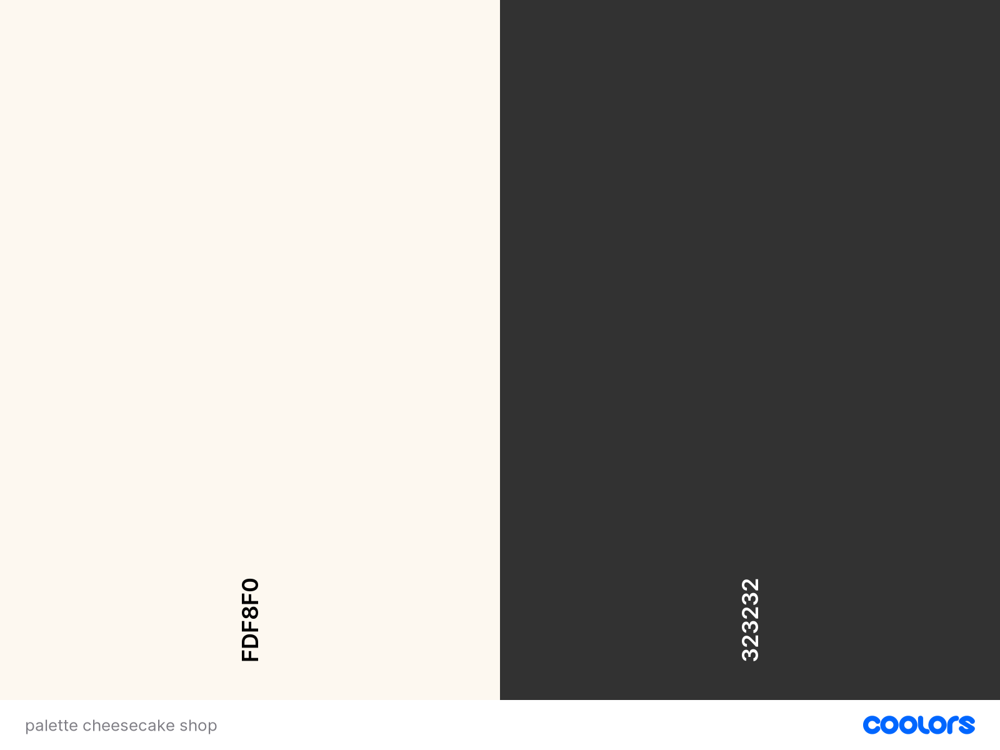

### Fonts

The Fonts used are [Roboto Serifs](https://fonts.google.com/specimen/Roboto+Serif?query=robot+ser) and [Montserrat](https://fonts.google.com/specimen/Montserrat?query=montse).

### **Logo**
[LOGO](https://logo.com/) was the webstie I've used to created logo for this project.

##### Back to [top](#table-of-contents)

# **Features**

## General features on each page

The navigation menu and footer are continiously the same throughout all the pages of my website.

### Home
- Home page includes nav bar, main body and a footer

Click here!

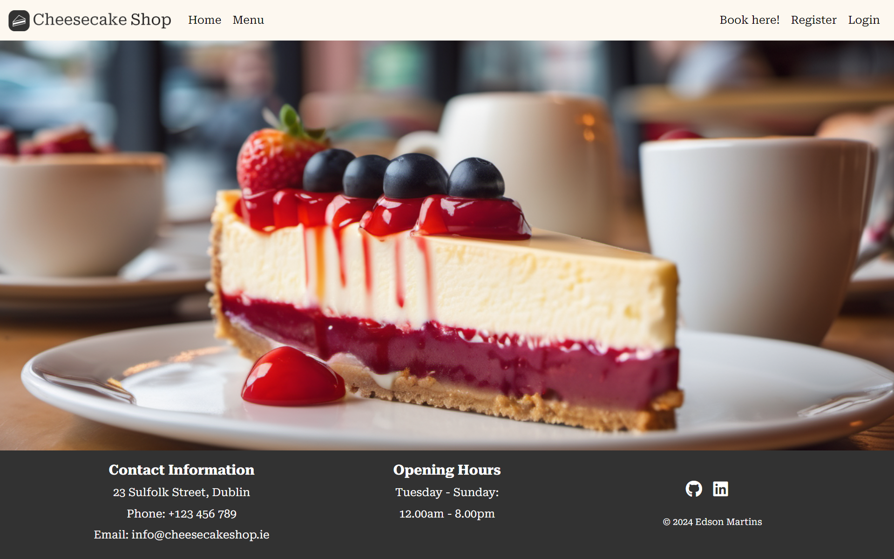

### Menu
- The menu is organized by styles and available flavors.
- Items can be added via the admin panel in the backend by staff
- Staff can create, update and delete foods via the admin panel

Click here!

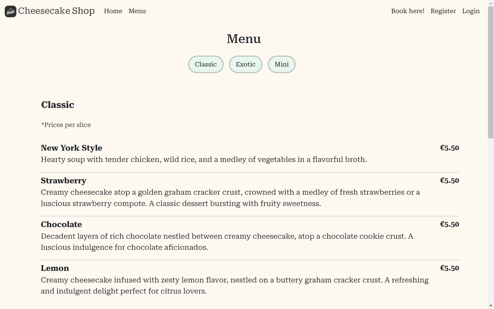

### Sign up page
- Allow users to register an account
- Username and password is required, email is optional

Click here!

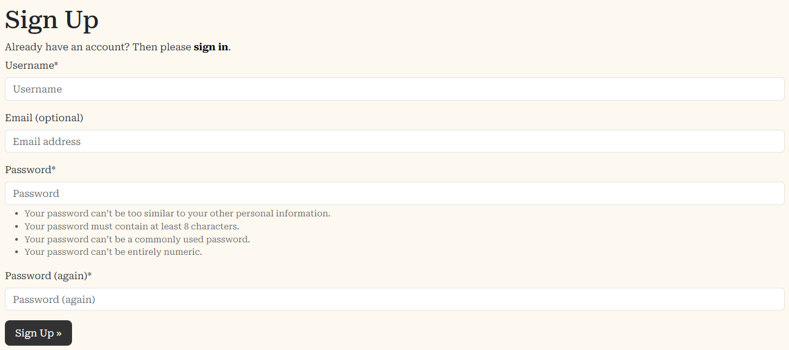

### Sign in
- User can login to create, view, edit and delete bookings

Click here!

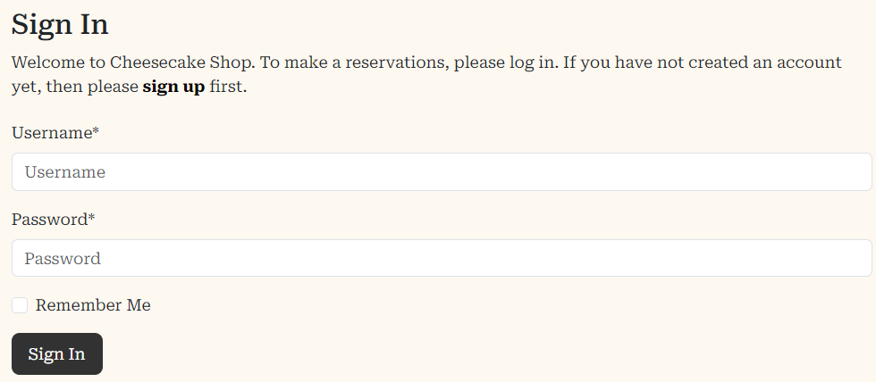

### Sign out
- Allows the user to securely log out
- Ask user if they are sure they want to log out

Click here!

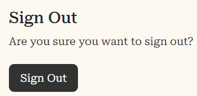

### Booking form
- Allows the user to book a table using the booking form
- Messages are displayed if the data is not valid 

Click here!

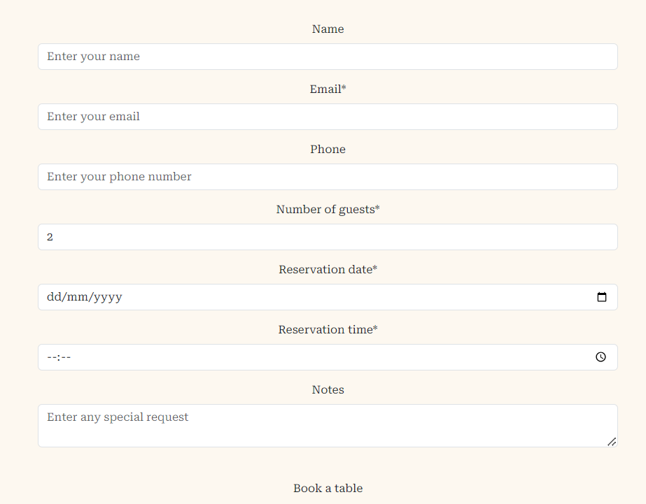

### My Bookings
- Allows the user to see a list with all their bookings
- Status of the booking is displayed, awaiting confirmation and when approved will then change to confirmed status for the user

Click here!

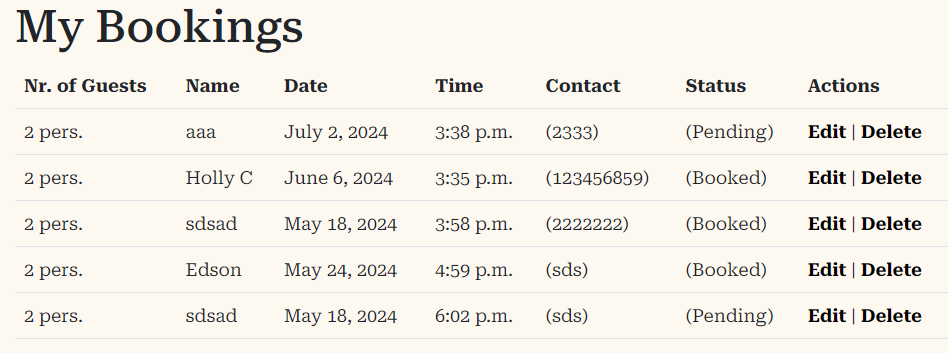

### Booking confirmation 

Click here!

### Edit booking 
- Allows the user to edit their booking details

Click here!

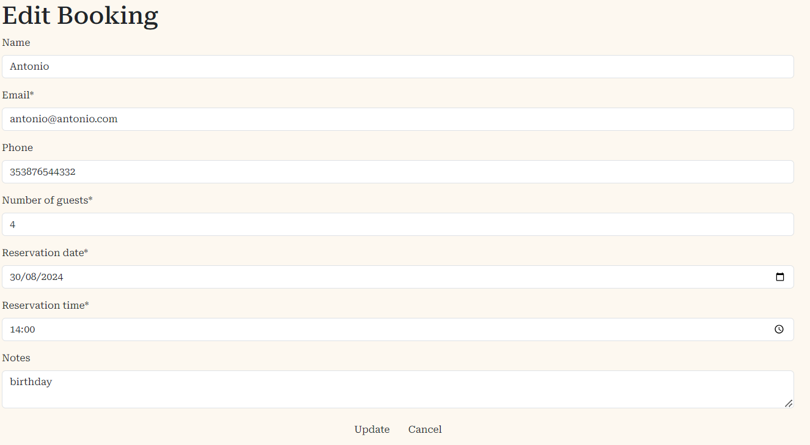

### Delete booking 
- Allows the user to delete/cancel their booking

Click here!

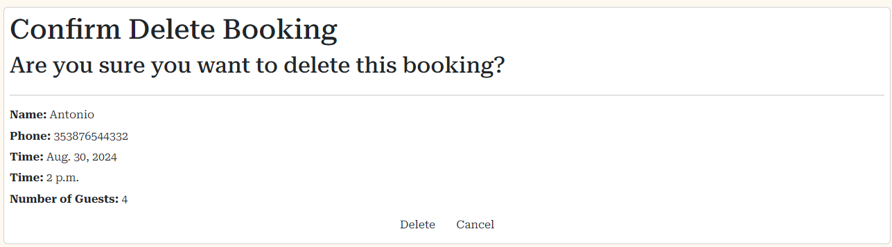

### Footer

Click here!

 

[Back to Contents](#table-of-contents)

### Future Implementations

A few user stories were excluded from the current project due to time limitations. They are visible in on the dedicated [GitHub Projects](https://github.com/) kanban board for this project. The following are some of features that could be implemented in future iterations and that have been added to the *future implementations* on the kanban board:

[Back to Contents](#table-of-contents)

# **Agile**

GitHub Project Boards and Kanban are instrumental in collaborative project management. To check the project's board click [here](https://github.com/users/EdsonSMartins/projects/2/views/1)

# **Testing**

Please refer to the separate [TESTING.md](TESTING.md) file.

# Technologies Used

### **Languages**

- [HTML](https://developer.mozilla.org/en-US/docs/Web/HTML)  
- [CSS](https://developer.mozilla.org/en-US/docs/Web/CSS)
- [JavaScript](https://developer.mozilla.org/en-US/docs/Web/JavaScript)

[Back to contents](#contents)

### Frameworks, Libraries & Programs Used

- [Bootstrap 5](https://getbootstrap.com/docs/5.0/getting-started/introduction/)    
- [jQuery](https://jquery.com/)   
- [Git](https://git-scm.com/)
- [GitHub](https://github.com/)
- [Gitpod](https://www.gitpod.io/)
- [Google fonts](https://fonts.google.com/)
- [Coolors](https://coolors.co/)
- [Lighthouse](https://developers.google.com/web/tools/lighthouse)
- [amiresponsive](http://ami.responsivedesign.is/)
- [JSHint](https://jshint.com/)
- [Django](https://www.djangoproject.com/)

[Back to contents](#contents)

# **Deployment**

Here is the [link to the deployed project](https://pp4-cheesecake-c25e3fb56709.herokuapp.com/).

## **Create Repository**

The first step is to create a new repository, using the [Code Institute Template](https://github.com/Code-Institute-Org/ci-full-template). After creating the repository, you can open it in the IDE of your choice.

## **Project Setup**

1. Install **Django** and **gunicorn**:
   - `pip install django gunicorn`
2. Install supporting **libraries**:
   - `pip install dj_database_url psycopg2`
3. Create **requirements.txt** file:
   - `pip freeze --local > requirements.txt`
4. Create a Django project:
   - `django-admin startproject <name>` (in my case `<name>` was *cheesecake_shop*)
5. Test to see if everything worked:
   - `python manage.py runserver`
   
## **Database Setup**

This project uses [ElephantSQL](https://customer.elephantsql.com/) for the PostgreSQL Database.

1. Log in to your account
2. Click *Create New Instance*
3. Give the instance a name and select the plan of your choice, *Tiny Turtle* is the free plan.
4. Click *Select Region* and choose a data center near you
5. Click *Review* and if the details are correct click *Create instance*
6. Click on the created instance and copy the database URL

## **Heroku Setup**

1. Log in to your [Heruko](https://www.heroku.com/) account
2. On the dashboard click *New* - *Create new app*
3. Give the app a unique name
4. Select the region closest to you and click *Create app*
5. Select your created app and open the *Settings* tab 
6. At the *Config Vars* section click *Reveal Config Vars* and add the following:
   - **DATABASE_URL** with the copied URL from ElephantSQL
   - **SECRET_KEY** with your secret key
   - **PORT** with the value 8000   
   - **DISABLE_COLLECTSTATIC** with the value 1

## **Final Changes**

1. Add `ALLOWED_HOSTS = ["PROJECT_NAME.herokuapp.com", "localhost"]` in **settings.py**
2. Create a **media**, **static** and **templates** directory and a **Procfile** file in the base directory
3. Add `web gunicorn pipetracker.wsgi` to **Procfile**
4. In your **Heroku app**: 
   - Go to the *Deploy tab* and connect your GitHub repository
   - Click on *Deploy Branch* at the bottom of the page

## **Forking**

Forking creates a copy of the project on GitHub. Follow these steps to fork this repository:
1. Log in to your GitHub account and navigate to [the Cheesecake repository](https://github.com/EdsonSMartins/PP4-cheesecake_shop_V2).
2. Click the **Fork** button on the top right of the repository.
3. You can now open the forked copy of this project as your own repository.
4. Follow the above steps to work on the project.

## **Packages**

- [django-extensions](https://django-extensions.readthedocs.io/en/latest/) - collection of custom extensions for the Django Framework, used for generating the ERD.
- [gunicorn](https://pypi.org/project/gunicorn/) - Python WSGI HTTP Server for UNIX.
- [psycopg2](https://pypi.org/project/psycopg2/) - PostgreSQL database adapter.
- [whitenoise](https://pypi.org/project/whitenoise/) - static file serving for Python web apps.
- [django-allauth](https://docs.allauth.org/en/latest/) - authentication, registration, account management.
- [django-crispy-forms](https://django-crispy-forms.readthedocs.io/en/latest/) - control the rendering behaviour of Django forms.

# **Credits**

Code Institue projects: 'Hello Django' and 'I think therefore I blog' has helped me a lot during the project planning for my websites design.
Extra help I've used for this project, please see links below.

### Code Used

- [w3schools](https://www.w3schools.com/)
- [Stack Overflow](https://stackoverflow.com/)
- [CSS Media Queries](https://www.w3schools.com/css/css3_mediaqueries.asp)
- [Grid-View](https://www.w3schools.com/css/css_rwd_grid.asp)
- [emmet.io](https://docs.emmet.io/cheat-sheet/)
- [Start Bootstrap](https://startbootstrap.com/theme/clean-blog)
- [Django documentation](https://docs.djangoproject.com/en/3.2/)

### Content

- The code is mostly created by me and I was inspired by my friend business [Cheesecakedalata](https://www.instagram.com/cheesecakedalata/?hl=en).
- The landing page image was generated on [Pixlr](https://pixlr.com/image-generator/).

# **Acknowledgements**

I would like to express my gratitude to my Code Institute mentor and the CI Tutor team, for guidance and clear advice to build this project.