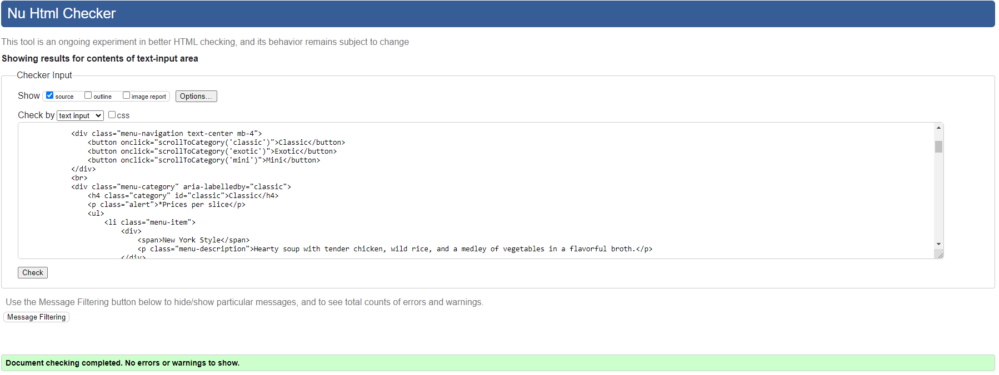
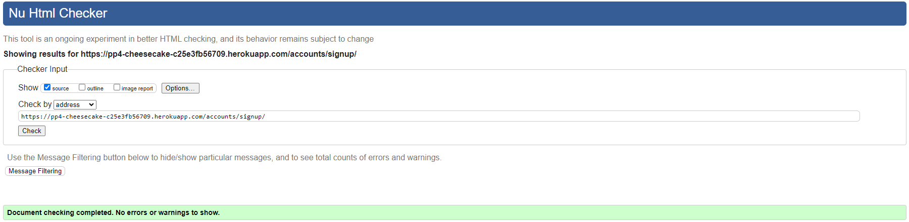
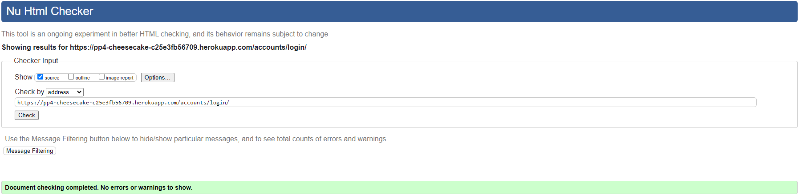

## Table of Contents - Testing
- [User Story Testing](#user-story-testing)
- [Code Validation](#code-validation)
- [Device Testing and Browser Testing](#device-testing-and-browser-testing)
- [Manual Testing](#manual-testing)
- [Bugs](#bugs)
- [Unsolved Bugs](#unsolved-bugs)

## User Story Testing

In order for the **Acceptance Criteria met** to be ticked, every criterion specified in the linked project issue has to be fulfilled.

| User Story                                                                                                                                                            | Link to Acceptance Criteria                                   | Acceptance Criteria met                |
|-----------------------------------------------------------------------------------------------------------------------------------------------------------------------|---------------------------------------------------------------|----------------------------------------|
| As a **site user**, I want to **use a navbar, footer, and social icons**, so that I can **navigate the site, access menus, and access socials**. | [link](https://github.com/EdsonSMartins/PP4-cheesecake_shop_V2/issues/1)  | &check; |
| As a **site user**, I want to **navigate across the site**, so that I can **move to each feature of the site easily**. | [link](https://github.com/EdsonSMartins/PP4-cheesecake_shop_V2/issues/2)  | &check;                                |
| As a **Site Owner**, I want to **provide a fully responsive site for my customers**, so that I can **ensure a good user experience**. | [link](https://github.com/EdsonSMartins/PP4-cheesecake_shop_V2/issues/3)  | &check; |
| As a **site user**, I want to **view the food menu**, so that I can **decide whether to eat at the business**. | [link](https://github.com/EdsonSMartins/PP4-cheesecake_shop_V2/issues/4)  | &check;                                |
| As a **site user**, I want to **visit an about page**, so that I can **learn more about the business**. | [link](https://github.com/EdsonSMartins/PP4-cheesecake_shop_V2/issues/5)  | Feature not included for first release  |
| As a **site user**, I want to **view the opening hours and contact details**, so that I can **plan ahead my next visit**. | [link](https://github.com/EdsonSMartins/PP4-cheesecake_shop_V2/issues/6)  | &check; |
| As a **site admin**, I want to **delete/update/approve bookings from any user**, so that I can **maintain the integrity of the platform and avoid duplicity**.  | [link](https://github.com/EdsonSMartins/PP4-cheesecake_shop_V2/issues/7)  | &check;                                |
| As a **site admin**, I want to **create, read, update and delete food items from menu**, so that I can **keep it updated according to product availability**. | [link](https://github.com/EdsonSMartins/PP4-cheesecake_shop_V2/issues/8)  | &check; |
| As a **site admin**, I want to **sign in**, so that I can **access the back end of the site**.                                                               | [link](https://github.com/EdsonSMartins/PP4-cheesecake_shop_V2/issues/9)  | &check;                                |
| As a **Site User/Admin**, I want to **Sign up as directed**, so that I can **initiate a table reservation**. | [link](https://github.com/EdsonSMartins/PP4-cheesecake_shop_V2/issues/10) | &check;                                |
| As a **Site User**, I want to **create a booking by completing a form**, so that I can **I can reserve my table**. | [link](https://github.com/EdsonSMartins/PP4-cheesecake_shop_V2/issues/11) | &check; |
| As a **Site User**, I want to **view my booking**, so that I can **manage my bookings and keep it up to date.**.  | [link](https://github.com/EdsonSMartins/PP4-cheesecake_shop_V2/issues/12) | &check; |
| As an **Site User**, I want to **be able to update my booking**, so that I can **make amendments if necessary.**. | [link](https://github.com/EdsonSMartins/PP4-cheesecake_shop_V2/issues/13) | &check; |
| As an **Site User**, I want to **be able to delete my booking**, so that I can **cancel my table reservation.** | [link](https://github.com/EdsonSMartins/PP4-cheesecake_shop_V2/issues/14) | &check; |
| As an **Site User**, I want to **be able to only book future dates**, so that I can **guarantee my booking is valid.** | [link](https://github.com/EdsonSMartins/PP4-cheesecake_shop_V2/issues/15) | &check; |
| As a **Site User**, I want to **register and establish an account**, so that I can **have my details stored for faster booking in future**. | [link](https://github.com/EdsonSMartins/PP4-cheesecake_shop_V2/issues/16) | &check; |
| As a **registered user**, I want to **log in to my account**, so that I can **access my bookings or make new ones**. | [link](https://github.com/EdsonSMartins/PP4-cheesecake_shop_V2/issues/17) | &check; |
| As a **site owner**, I want to **manage user roles**, so that I can **choose who can access sensitive information.** | [link](https://github.com/EdsonSMartins/PP4-cheesecake_shop_V2/issues/18) | Feature not included for first release |

## Code Validation
### HTML
All HTML pages were run through the [W3C HTML Validator](https://validator.w3.org/). Results in the table below

|Page|Result|
|----|----|
|Home|✔|
|Menu|✔|
|Sign up|✔|
|Sign in|✔|
|Sign out|✔|
|Booking form|✔|
|My Bookings|✔|
|Booking confirmation|✔|
|Edit Booking|✔|
|Delete Booking|✔|

Home

Menu

Sign up

Sign in

Sign out

Booking form

My Bookings

Booking Confirmation

Edit Booking

Delete Booking

The errors received pertain to the built-in Django functionalities and are independent of any issues with the HTML structure.

### CSS
The W3C Jigsaw CSS Validation Service

CSS

### Python

I ran the linter on my entire project, and after making a few adjustments, such as correcting line lengths, no further errors were found.

- [CI Python Linter](https://pep8ci.herokuapp.com/) was used to validate Python code.

## Device Testing and Browser Testing

BrowserStack played a crucial role by providing access to real devices for testing, as opposed to just emulators. The devices I used to test my site are:

Safari

Mozila Firefox

Google Chrome

Samsung S23

Iphone 14

## Manual Testing

**Feature** | **Action** | **Expected Result** | **Actual Result** | 
------------ | ------------ | ------------ | ------------ | 
| 'Home' link in the navigation bar | Click | Homepage will load| Works as expected |
| 'Sign up' link in the navigation bar | Click | Sign up page will load| Works as expected | 
| 'Sign in' link in the navigation bar | Click | Login page will load| Works as expected |
| 'Menus' link in the navigation bar, select 'Food Menu' | Click | Food menu page will load| Works as expected |
| 'Book here' link in the navigation bar | Click | Reservations page will load| Works as expected |
| 'Book a table' link in Booking form | Click | Booking confirmation page will load| Works as expected |
| 'My Bookings' link in the navigation bar | Click | Booking list page will load| Works as expected |
| 'Edit' link in My Bookings form | Click | Selected booking page will load| Works as expected |
| 'Update' link in Edit Bookings form | Click | Save changes and return to Booking list| Works as expected |
| 'Cancel' link in Edit Bookings form | Click | Discard changes and return to Booking list| Works as expected |
| 'Delete' link in My Bookings form | Click | Confirm Delete Booking page will load| Works as expected |
| 'Delete' link in Confirm Delete Booking form | Click | Delete booking and return to Booking list| Works as expected |
| 'Cancel' link in Confirm Delete Booking form | Click | Discard changes and return to Booking list| Works as expected |
| 'Sign out' link in the navigation bar | Click | Logout page will load| Works as expected |
| 'Sign out' link in Sign out page | Click | User sign out and return to main page | Works as expected |
| 'Social Media' links in the footer | Click | Direct access to my Github repo and Linkedin account on a new window| Works as expected |

## Bugs

| **Bug** | **Fix** |
| ------- | ------- |
| Users could choose a booking date from a past date | This was remedied by adding the MinValueValidator to the Booking model |
| Booking could be made outside opening hours| The function 'validate_opening_hours' was created to set opening and closing time and to prevent getting bookings too close to closing times|
| Static file not loading | I have to disable cache on devtools and refresh page while devtools open |
| The links to menu sections on the menu page did not function as intended | Applied ScrollToCategory method |
| Booking could not been completed due to an user_id error | deleted migrations and reviewed model however the solution was creating a new app transfer the code to the new app, makemigrations and migrate |
 
## Unsolved Bugs
No unsolved bugs reported in the project

[Back to Contents](#table-of-contents---testing)