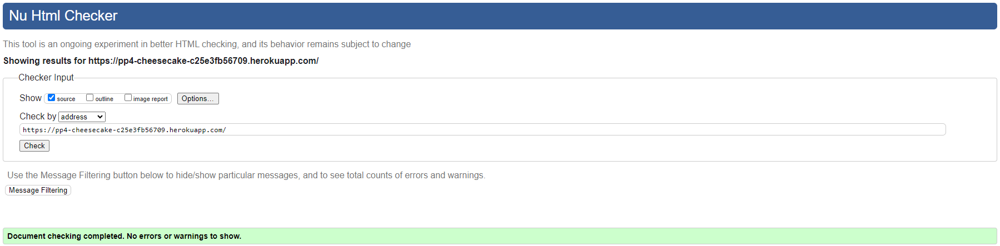

## Table of Contents - Testing
- [User Story Testing](#user-story-testing)
- [Code Validation](#code-validation)
- [Browser Testing](#browser-testing)
- [Lighthouse](#lighthouse)
- [Manual Testing](#manual-testing)
- [Bugs](#bugs)
- [Unsolved Bugs](#unsolved-bugs)

## User Story Testing

## Code Validation
### HTML
All HTML pages were run through the [W3C HTML Validator](https://validator.w3.org/). Results in the table below

|Page|Result|
|----|----|
|Home|✔|
|Menu|✔|
|Sign up|✔|
|Sign in|✔|
|Sign out|✔|
|Booking form|✔|
|My Bookings|✔|
|Booking confirmation|✔|
|Edit Booking|✔|
|Delete Booking|✔|

Home

Menu

Sign up

Sign in

Sign out

Booking form

My Bookings

Booking Confirmation

Edit Booking

Delete Booking

The errors received pertain to the built-in Django functionalities and are independent of any issues with the HTML structure.

### CSS
The W3C Jigsaw CSS Validation Service

CSS

### Python

I ran the linter on my entire project, and after making a few adjustments, such as correcting line lengths, no further errors were found.

- [CI Python Linter](https://pep8ci.herokuapp.com/) was used to validate Python code.

## Device Testing & Browser Testing

BrowserStack played a crucial role by providing access to real devices for testing, as opposed to just emulators. The devices I used to test my site are:

Safari

Mozila Firefox

Google Chrome

Samsung S23

Iphone 14

## Manual Testing

**Feature** | **Action** | **Expected Result** | **Actual Result** | 
------------ | ------------ | ------------ | ------------ | 
| 'Home' link in the navigation bar | Click | Homepage will load| Works as expected |
| 'Sign up' link in the navigation bar | Click | Sign up page will load| Works as expected | 
| 'Sign in' link in the navigation bar | Click | Login page will load| Works as expected |
| 'Menus' link in the navigation bar, select 'Food Menu' | Click | Food menu page will load| Works as expected |
| 'Book here' link in the navigation bar | Click | Reservations page will load| Works as expected |
| 'Book a table' link in Booking form | Click | Booking confirmation page will load| Works as expected |
| 'My Bookings' link in the navigation bar | Click | Booking list page will load| Works as expected |
| 'Edit' link in My Bookings form | Click | Selected booking page will load| Works as expected |
| 'Update' link in Edit Bookings form | Click | Save changes and return to Booking list| Works as expected |
| 'Cancel' link in Edit Bookings form | Click | Discard changes and return to Booking list| Works as expected |
| 'Delete' link in My Bookings form | Click | Confirm Delete Booking page will load| Works as expected |
| 'Delete' link in Confirm Delete Booking form | Click | Delete booking and return to Booking list| Works as expected |
| 'Cancel' link in Confirm Delete Booking form | Click | Discard changes and return to Booking list| Works as expected |
| 'Sign out' link in the navigation bar | Click | Logout page will load| Works as expected |
| 'Sign out' link in Sign out page | Click | User sign out and return to main page | Works as expected |
| 'Social Media' links in the footer | Click | Direct access to my Github repo and Linkedin account on a new window| Works as expected |

## Bugs

| **Bug** | **Fix** |
| ------- | ------- |
| Users could choose a booking date from a past date | This was remedied by adding the MinValueValidator to the Booking model |
| Booking could be made outside opening hours| The function 'validate_opening_hours' was created to set opening and closing time and to prevent getting bookings too close to closing times|
| Static file not loading | I have to disable cache on devtools and refresh page while devtools open |
| The links to menu sections on the menu page did not function as intended | Applied ScrollToCategory method |
| Booking could not been completed due to an user_id error | deleted migrations and reviewed model however the solution was creating a new app transfer the code to the new app, makemigrations and migrate |
 
## Unsolved Bugs
No unsolved bugs reported in the project

[Back to Contents](#table-of-contents---testing)